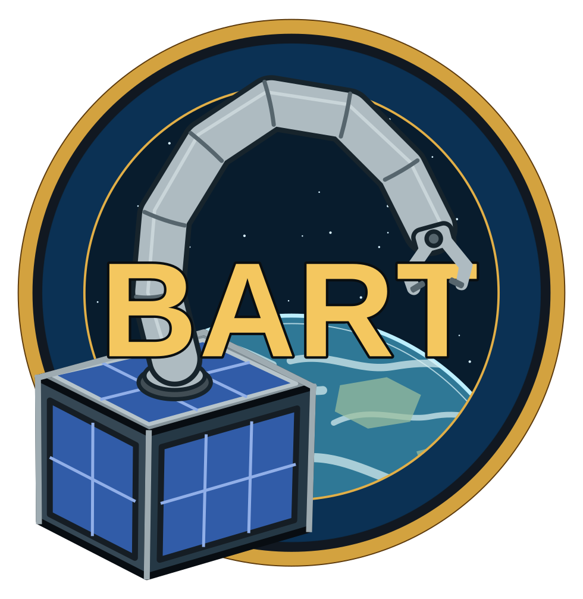

<p align="center">
  
</p>

<h1 align="center">PATTY - PArabolic flighT annoucmenT simulator - for You!</h1>

<p align="center"><em><sub>every great project needs a bad acronym ;)</sub></em></p>

<p align="center">
  <strong>A local training simulator for timed parabolic-flight announcements.</strong><br>
  <a href="../../issues">Report a bug or request a feature</a>
  ·
  <a href="https://www.linkedin.com/in/maximilian-von-unwerth-578679208/?isSelfProfile=true">Connect on LinkedIn</a>
</p>

## About PATTY

Some procedures have to be executed at exactly the right moment. PATTY helps crews practise those sequences with a repeatable flight timeline, synchronised English audio announcements, a live timer, a parabolic-flight counter and a colour-coded gravity display. The simulator makes it easier to rehearse together before the real flight, when timing and clear communication matter most.

The application runs locally, so the supplied announcement audio is available without an API key, cloud service or browser speech engine. The interface supports English, German and French; the training voice remains English so every rehearsal uses the same callouts.

## Quickstart

### Requirements

- Python 3.10 or newer
- A modern browser with Web Audio API support

### Run on Windows

```powershell
py -m venv .venv
.\.venv\Scripts\Activate.ps1
py -m pip install -r requirements.txt
py app.py
```

Open [http://127.0.0.1:5000](http://127.0.0.1:5000) in your browser. You can also run `start.bat` after installing the dependencies.

### Run on macOS or Linux

```bash
python3 -m venv .venv
source .venv/bin/activate
python3 -m pip install -r requirements.txt
python3 app.py
```

## Using the simulator

Choose the number of parabolas and the starting point, then use **Test voice**, **Test countdown** or **Start training**. The space bar starts or pauses a session; `F` toggles fullscreen. **Reset** applies new settings and starts a fresh session. Leaving the browser tab pauses the training.

The gravity panel uses green for 1 g, red for 1.8 g, yellow for 0 g and brown for the transition phases. The flight profile includes a marker showing the current position. All calls are scheduled against the Web Audio clock so the sound and timer stay aligned.

## Localisation

All user-facing strings are stored in [`static/locales.json`](static/locales.json), making translations easy to review and edit through GitHub. Add a locale with the existing `en`, `de` and `fr` structure. Announcement wording and call strings remain the original English in every interface language; the audio assets in [`static/audio`](static/audio) are English Microsoft Zira recordings and are used for every training language.

## Development

Run the checks before opening a pull request:

```powershell
py -m unittest discover -s tests
node tests/timeline.mjs
node tests/audio.mjs
```

The optional [`scripts/generate-audio.ps1`](scripts/generate-audio.ps1) script regenerates the bundled English WAV files on Windows with Microsoft Zira Desktop.

## Help us improve the simulator

If you would like a feature, find a bug or have an idea for improving the training flow, please [open an issue](../../issues). You are also welcome to fix it directly and submit a pull request.

PATTY was created by [Maximilian von Unwerth](https://www.linkedin.com/in/maximilian-von-unwerth-578679208/?isSelfProfile=true) as part of the BART project, a collaboration between the **Chair of Space Technology at TU Berlin** and **SLA at RWTH Aachen**, during the **47th DLR Parabolic Flight Campaign**.

The source code is released under the [PATTY Attribution License 1.0](LICENSE). Logos, trademarks and bundled Microsoft Zira audio are excluded; see [`NOTICE.md`](NOTICE.md).
